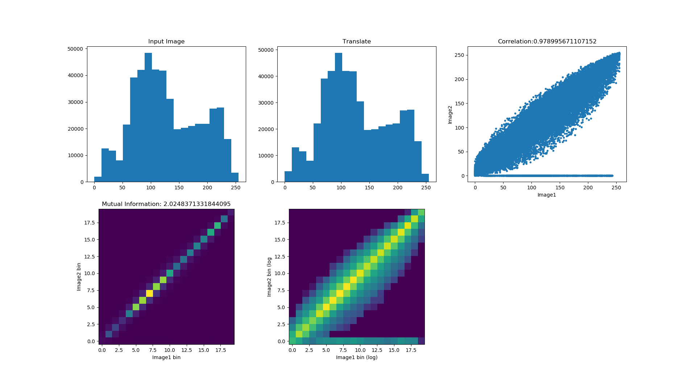
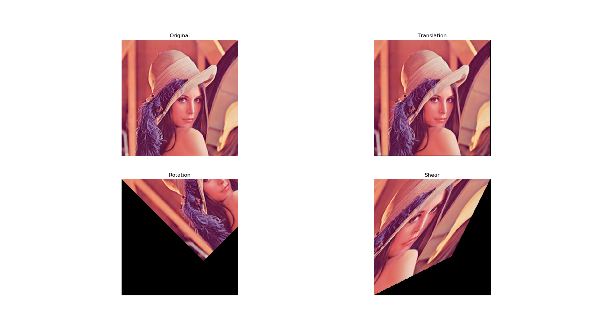
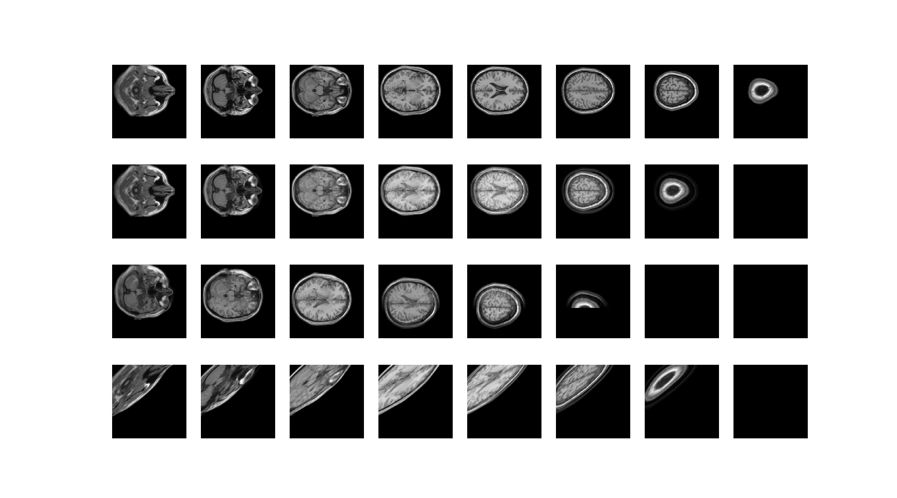

# Image-Transform
A python implementation for affine and vector deformable transformation on 2D and 3D images

## Introduction
This repository provides an example code for 2D and 3D images transformation using different transformation methods, including affine transform and vector field deformation.

The code includes two parts, transformation grid generation and a bilinear resampler. The image matching metrics will also provides based on image histogram.

## Usage
User may alter the dimension as `MODE = '2D'`  or `MODE = '3D'`. To choose affine or vector transform, set `METHOD='AFFINE'` or `METHOD='VECTOR'` respectively.

The affine transform result will be displayed with translation, rotation and shear. Please note that in 3D mode the image will be rotated with Euler angle in Tait-Bryan form, concatenation order should always be taken in care.

## Outputs
Similarity metric plots based on histograms:

2D affine transformation result:

3D affine transformation result (From up to down rows: original, translation, rotation, shear):

## Reference
- [Deep Learning Paper Implementations: Spatial Transformer Networks - Part I](https://kevinzakka.github.io/2017/01/10/stn-part1/)
- [Deep Learning Paper Implementations: Spatial Transformer Networks - Part II](https://kevinzakka.github.io/2017/01/18/stn-part2/)
- [Mutual information as an image matching metric](https://matthew-brett.github.io/teaching/mutual_information.html)